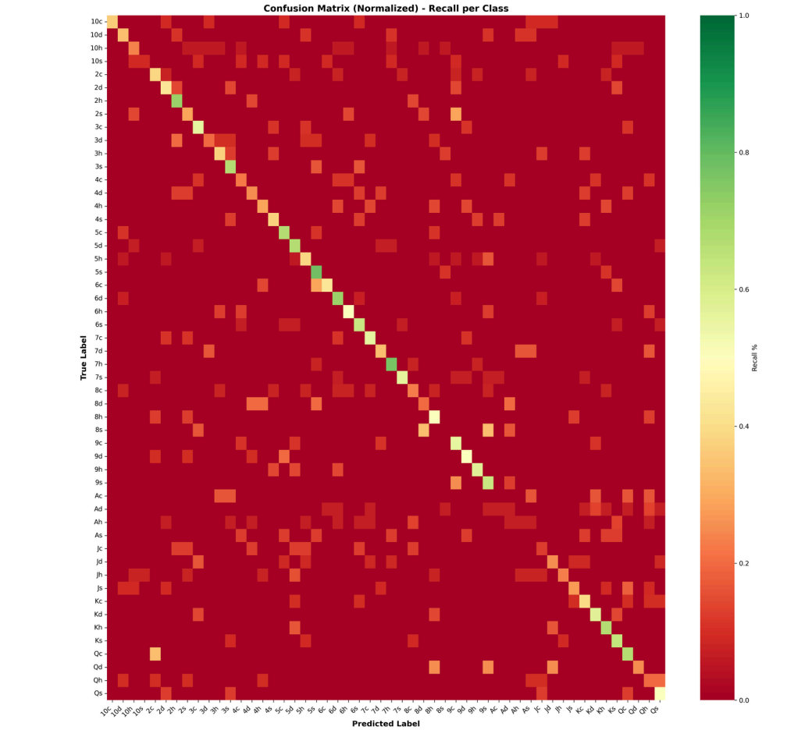
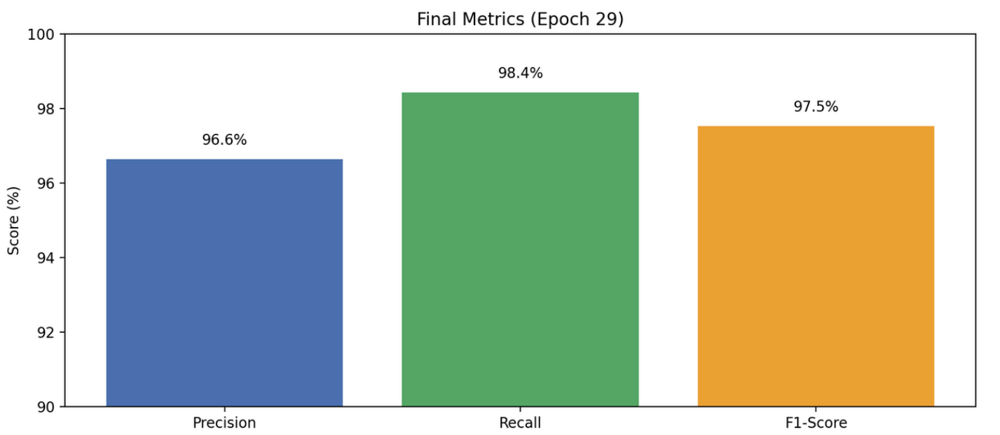
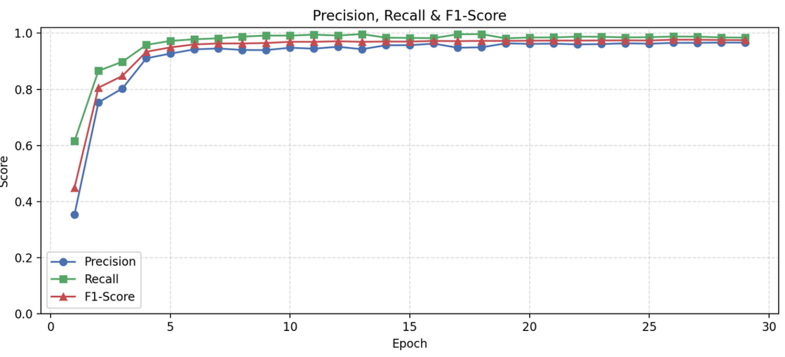
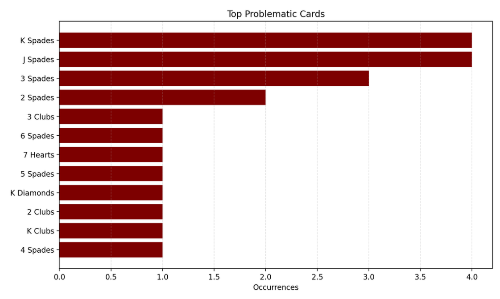
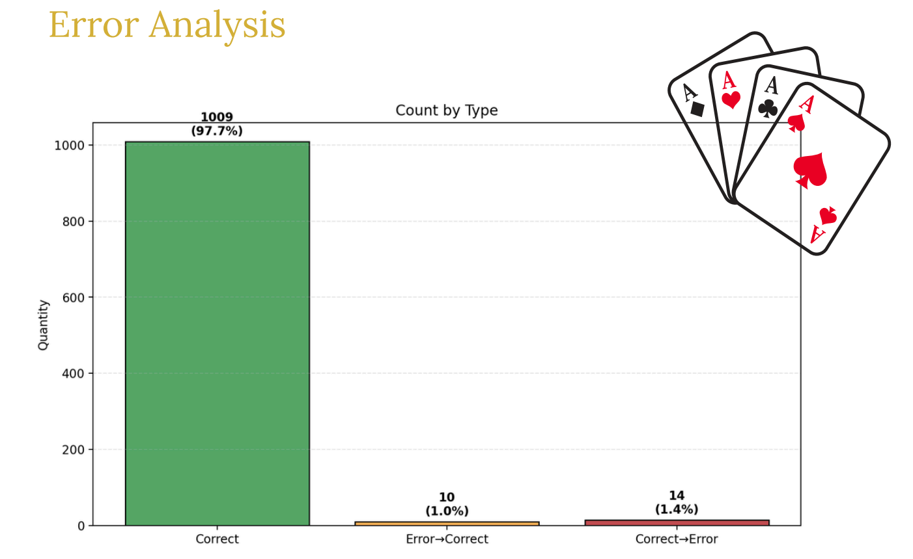
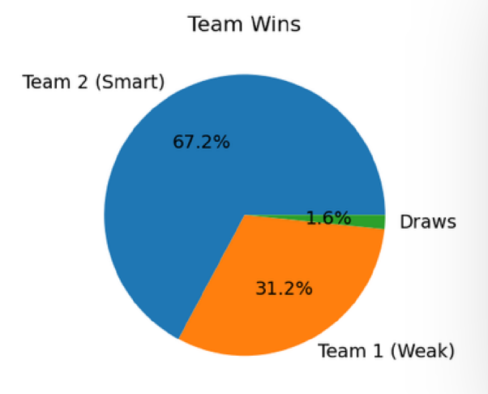
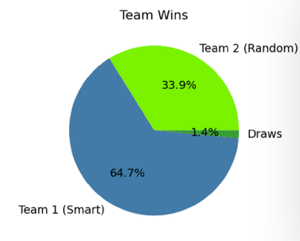
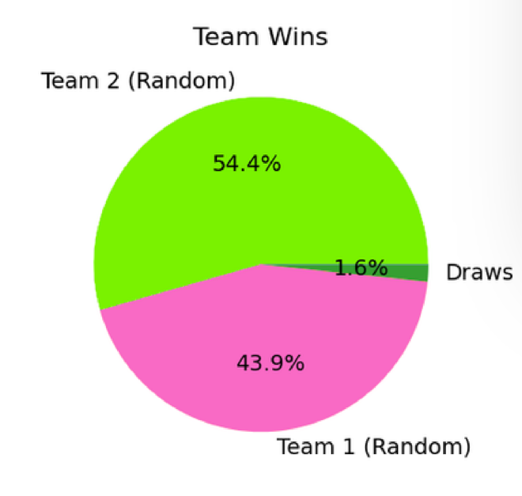
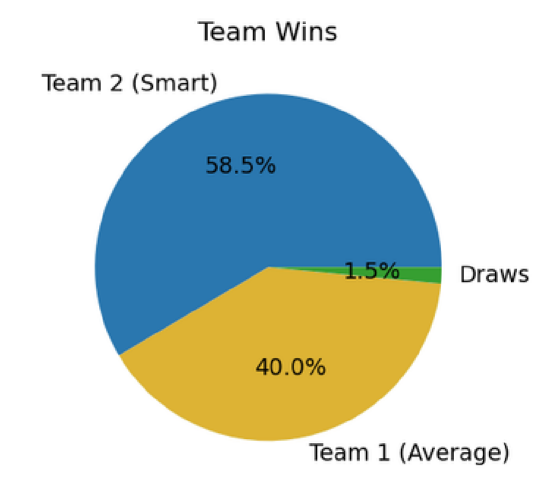

# AI Models Validation

## Computer Vision Module

### Performance Evaluation

### Boundary Testing

The system was tested under:

- Blurry images
- Low/high brightness conditions
- Cards thrown at different angles
- Cards too close or too far from camera

---

## Mitigation Strategies

- Adaptive threshold tuning
- Reverse action button for corrections

---

## Agent Validation Results

### Agent Types

- Weak Agent
- Random Agent
- Average Agent
- Smart Agent

Agents operate at different difficulty levels (Level 1 → Level 4).

---

### Key Observations

- Smart agents generally outperform weaker agents
- However, extreme hand imbalance can lead to unexpected outcomes

---

## Simulation Results

- 10,000 simulated game rounds
- Comparisons between:
  - Smart vs Weak

  
  - Smart vs Random

  
  - Random vs Random

  
  - Smart vs Average
  
  

---

