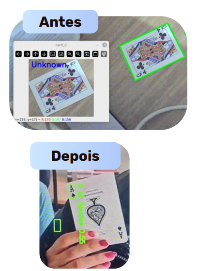
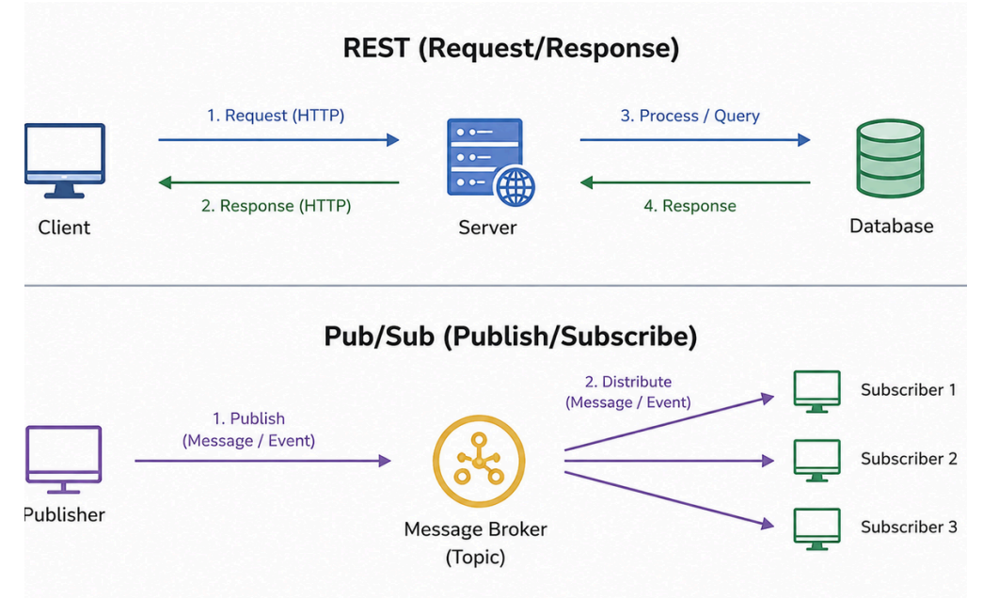

# Key Challenges

## Card Recognition

### Antes
- Detecção das cartas inteiras  
- Difficulty in recognizing cards with different:
  - lights  
  - angles  
  - image qualities  

### Depois
- Deteção apenas dos cantos das cartas  

---

## REST Problems

### Antes

- pure REST  

Necessidade de comunicação real-time entre múltiplos clientes (host + virtuais) e backend  

### Depois

- REST + PubSub + Websockets  

REST para operações CRUD; PubSub para sincronização real-time; Websockets para streaming  

---
